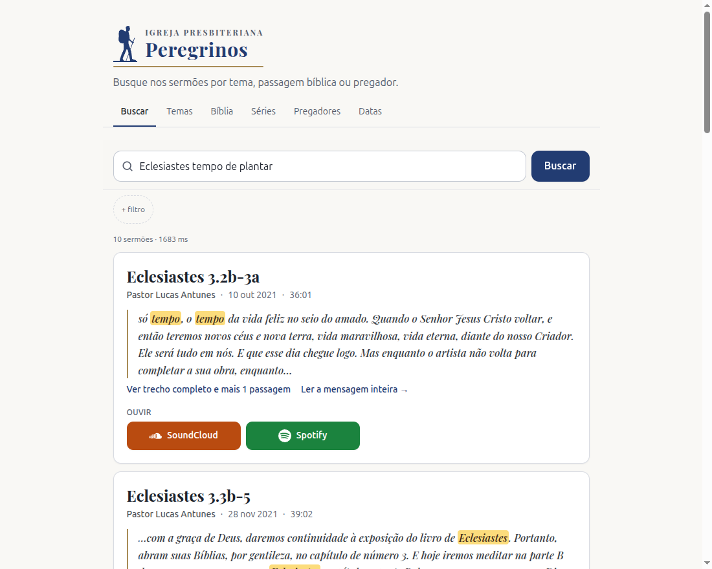
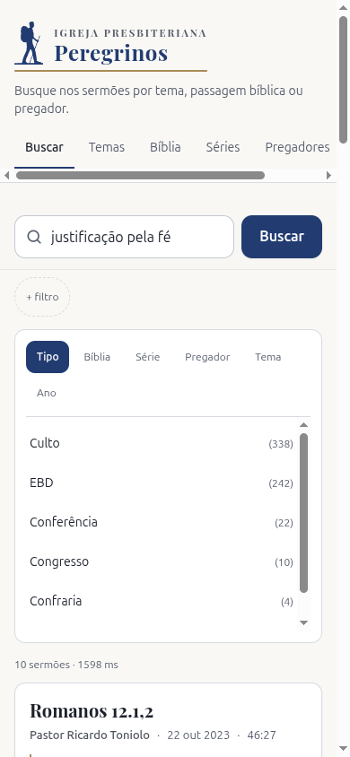
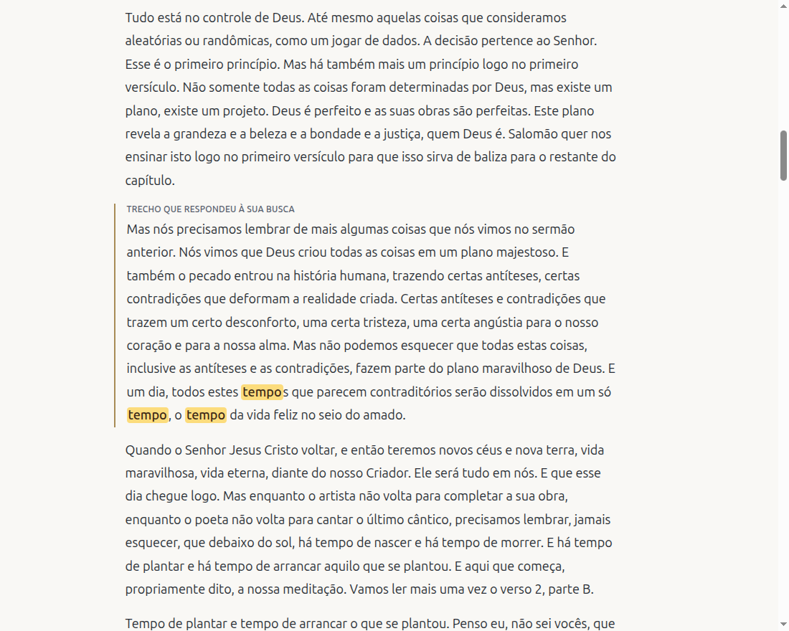
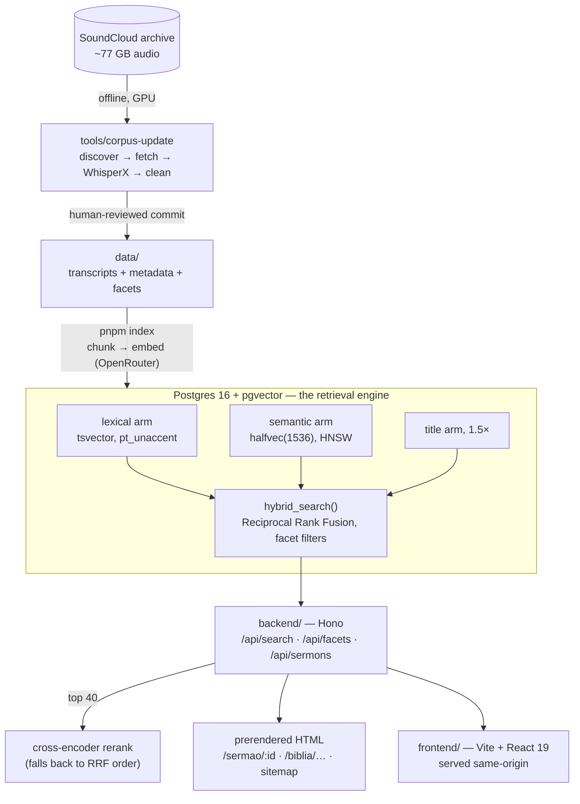

# sermon-search

[](https://github.com/eusoubrasileiro/sermon-search/actions/workflows/ci.yml)
[](./LICENSE)
[](https://ipp-sermons.amiticia.cc)

*Busca nos sermões por tema, passagem bíblica ou pregador.*

Ask a church's sermon archive a question in plain Portuguese and get back the
sermons that answer it: the passage that matched, and a link to listen on
SoundCloud or Spotify.

It is live for [Igreja Presbiteriana Peregrinos](https://ipperegrinos.com) at
**<https://ipp-sermons.amiticia.cc>**, over 600+ sermons transcribed from years
of recordings.

<p>
  
  
</p>

A search like *"briga na igreja"* ("fighting in church") has to find sermons
that never use those words, while *"Eclesiastes 3.2b-3a"* has to hit an exact
scripture reference that an embedding would blur. So retrieval is **hybrid**:
a lexical arm and a semantic arm fused inside Postgres, then reranked by a
cross-encoder. Beyond search, the archive can be browsed by topic, Bible book
and chapter, series, preacher and date, and every sermon opens as a full
transcript scrolled to the passage that answered you.



## Architecture



One container serves the API, the SPA and the prerendered pages. `shared/`
holds the Zod schemas that both sides validate against.

## Retrieval design

- **Three arms, fused by Reciprocal Rank Fusion (k=60) in SQL.**
  - **Lexical:** `ts_rank_cd` over a generated `tsvector` with Portuguese
    stemming and accent folding. It exists for the proper nouns and scripture
    references that embeddings blur.
  - **Semantic:** Gemini embeddings, Matryoshka-truncated from 3072 to 1536
    dimensions because pgvector's HNSW index caps at 2000.
  - **Title:** weighted 1.5×. A preacher rarely says the title out loud, so one
    sermon ranked 52nd for its own title until titles became their own arm.
- **Cross-encoder rerank over 40 candidates.** Every failure mode (timeout,
  error, bad response) degrades to the RRF order. A slow reranker must never
  turn a working search into an error page.
- **Why SQL and not LangChain:** a vector-store abstraction exposes similarity
  search and nothing to fuse it with. Fusing in application code would ship
  both candidate lists over the wire just to rank them.
  [`hybrid_search()`](backend/prisma/sql/003_hybrid_search.sql) does it next
  to the data.
- **Facets come from LLM passes, offline.** Scripture references, topics and
  series are extracted once per corpus update, reviewed by a human as a git
  diff, and loaded from committed CSVs. Filtering by them at query time
  costs no model call.
- **Server-rendered HTML for crawlers.** The long-tail Portuguese prose is
  exactly what search engines reward, so sermon, Bible and topic pages are
  prerendered per request rather than served as one empty SPA shell.

## Corpus pipeline

Transcription is the only step that needs a GPU, and it runs offline:
[`tools/corpus-update`](tools/corpus-update) (Python and WhisperX) discovers new
uploads, fetches them, transcribes and cleans. The result lands as a commit
under `data/` that a human reviews. [`scripts/corpus-update.sh`](scripts/corpus-update.sh)
then derives facets, indexes and deploys, with an optional stop at each
checkpoint. The audio never enters this repository.

## Engineering discipline

This project is built by AI agents under a human product owner, so the gates
are what make its output trustworthy:

- **TDD, with unit tests that touch neither the database nor the network.**
  `createApp()` takes its dependencies, so the real routes run against stubs.
  Coverage is about 97% on the backend and 99% on the frontend.
- **A ratcheted quality gate** ([`quality-baseline.json`](quality-baseline.json)):
  coverage, file size, complexity, duplication, dead code and `any` casts can
  only hold or improve.
- **A golden eval set** ([`backend/test/golden/queries.json`](backend/test/golden/queries.json)),
  scored as recall@10 against the real database and APIs by `pnpm eval`. It is
  the only proof that search quality didn't quietly regress, which no unit
  test can see.
- **An LLM reviewer on every commit and push.** It fails closed and demands a
  regression test with every `fix:`. Critical paths (migrations, deploy files,
  the corpus, the golden set, every `*.md`) additionally need the owner's
  `Ratified-by:` trailer.
- **CI** re-runs the checks that need no secrets on every push and pull
  request, so none of them can be skipped locally.

## Using it for another church

The product is generic; the configuration is not, yet. Today these are
specific to the Peregrinos deployment:

- `data/`: the corpus itself;
- `frontend/src/components/Logo.tsx` and the landing copy in `States.tsx`;
- the site origin, `PUBLIC_BASE_URL`;
- the SoundCloud account and Spotify show in `tools/corpus-update/config.py`.

Pulling these into one per-church configuration is the next step toward
serving more than one congregation.

## Running it locally

```bash
cp .env.example .env                       # OPENROUTER_API_KEY and the database URL
pnpm install
pnpm --filter @ipp/shared build
pnpm --filter @ipp/backend exec prisma generate
pnpm db:up && pnpm db:push                 # Postgres + pgvector on :5439
pnpm index --limit 5 && pnpm index:facets  # a small smoke index
pnpm dev
```

[`CLAUDE.md`](CLAUDE.md) carries the full development guide, the operational
traps and the deployment runbook.

## License

The code is [MIT](LICENSE). The sermon corpus under `data/` belongs to Igreja
Presbiteriana Peregrinos and is not covered; see [`NOTICE`](NOTICE).
